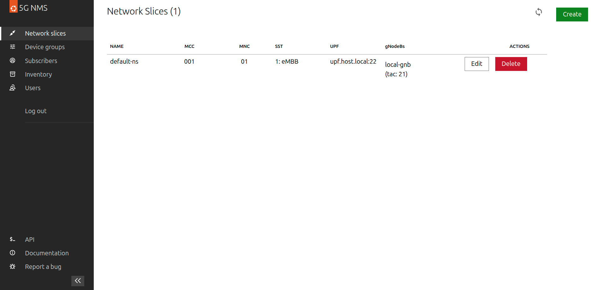

# Aether SD-Core NMS

A Network Management System for managing the Aether SD-Core 5G core network.



## Usage

NMS needs to be configured with the following environment variables:
- `WEBUI_ENDPOINT`: The endpoint of the webui. This is used to redirect the swagger operations to the webui.
- `UPF_CONFIG_PATH`: The path to the UPF configuration file. An example of this file can be seen in the `examples/` directory.
- `GNB_CONFIG_PATH`: The path to the gNodeB configuration file. An example of this file can be seen in the `examples/` directory.

```console
export WEBUI_ENDPOINT=10.1.182.28:5000
export UPF_CONFIG_PATH=/path/to/upf_config.json
export GNB_CONFIG_PATH=/path/to/gnb_config.json

docker pull ghcr.io/canonical/sdcore-nms:0.2.0
docker run -it --env UPF_CONFIG_PATH --env GNB_CONFIG_PATH --env WEBUI_ENDPOINT ghcr.io/canonical/sdcore-nms:0.2.0
```
